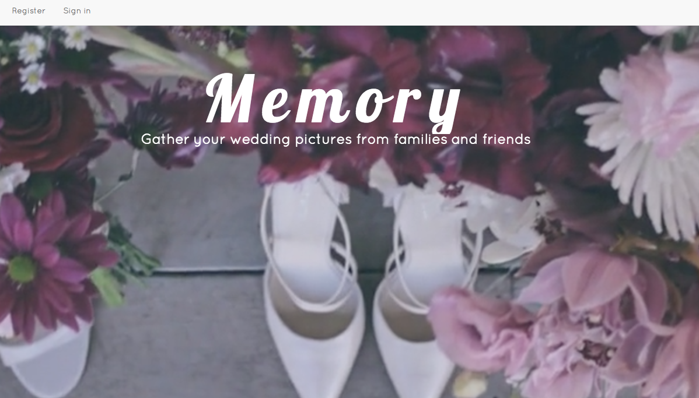
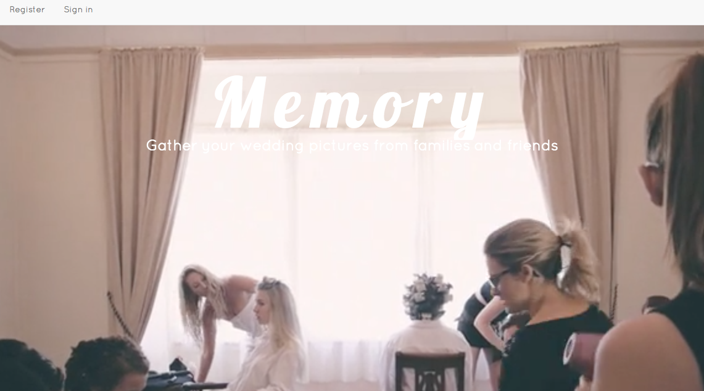
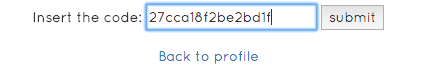

#Memory Board
###Memory is a web application that helps users to create memory boards where they can gather event pictures from friends and family. Each board has a unique code which can be given to other users. Once enter the code, invited users can upload the event pictures to the memory board.
###See demo here: https://glacial-badlands-21746.herokuapp.com/

#How Memory Board Works

##Landing page with Sign in / Register

##User can create their own memory board (photo album) and upload their event pictures

##Each board comes with a 16-digits randomly generated code, which can be given to friends and families as an access code
###Click *find* and *enter* the code to access to the memory board

##Here you go! Your friends and families can share the pictures on your memory board!

