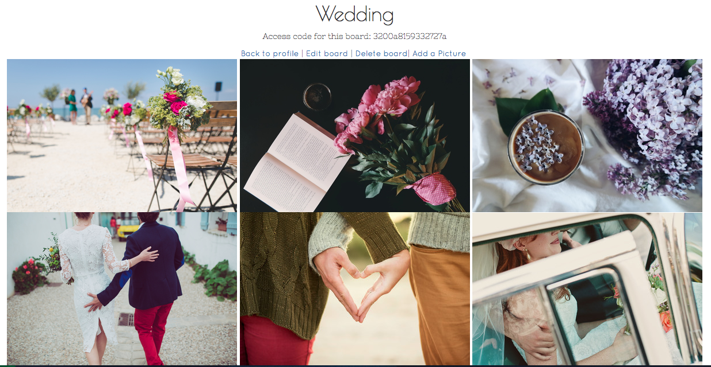

#Memory Board
###Memory is a web application that helps users to create memory boards where they can gather event pictures from friends and families. Each board has a unique code which can be given to other users. Once enter the code, invited users can upload the event pictures to the memory board.
###See demo here: https://glacial-badlands-21746.herokuapp.com/

#How Memory Board Works

###Landing page with Sign in / Register

###User can create their own memory board (photo album) and upload their event pictures

###Each board comes with a randomly generated 16-digits code, which can be given to friends and families as an access code

###Here you go! Your friends and families can share the pictures on your memory board!

##MemoryBoard is a Ruby on Rails project
####Thank you for stopping by!
#####Video credit: Tim&Hannah Wedding on Vimeo: https://vimeo.com/94837904
